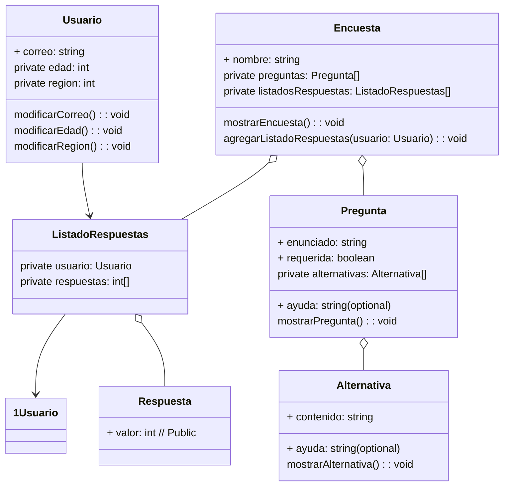

```mermaid
classDiagram
  class Usuario {
    + correo: string
    private edad: int
    private region: int
    
    modificarCorreo(): void
    modificarEdad(): void 
    modificarRegion(): void 
  }
  
  class Encuesta {
    + nombre: string
    private preguntas: Pregunta[]
    private listadosRespuestas: ListadoRespuestas[]  
    
    mostrarEncuesta(): void
    agregarListadoRespuestas(usuario: Usuario): void 
  }
  
  class Pregunta {
    + enunciado: string 
    + ayuda: string (optional) 
    + requerida: boolean 
    private alternativas: Alternativa[]  
    
    mostrarPregunta(): void
  }
  
  class Alternativa {
    + contenido: string 
    + ayuda: string (optional) 
    
    mostrarAlternativa(): void
  }
  
  class ListadoRespuestas {
    private usuario: Usuario  
    private respuestas: int[] 
  }
  
  class Respuesta {
    + valor: int // Public
  }
  
  Usuario --> ListadoRespuestas
  Encuesta o-- Pregunta
  Encuesta o-- ListadoRespuestas
  Pregunta o-- Alternativa
  ListadoRespuestas --> 1 Usuario
  ListadoRespuestas o-- Respuesta
```