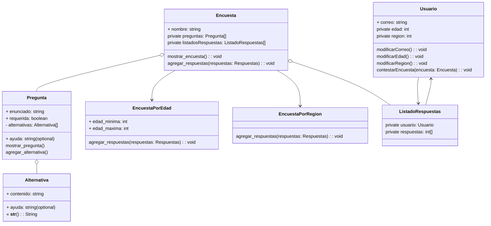

```mermaid
classDiagram
  class Usuario {
    + correo: string
    private edad: int
    private region: int
    
    modificarCorreo(): void
    modificarEdad(): void 
    modificarRegion(): void 
    contestarEncuesta(encuesta: Encuesta): void
  }
  
  class Encuesta {
    + nombre: string
    private preguntas: Pregunta[]
    private listadosRespuestas: ListadoRespuestas[]  
    
    mostrar_encuesta(): void
    agregar_respuestas(respuestas: Respuestas): void 
  }

    class EncuestaPorEdad {
    + edad_minima: int
    + edad_maxima: int

    agregar_respuestas(respuestas: Respuestas): void 
  }

  class EncuestaPorRegion {

    agregar_respuestas(respuestas: Respuestas): void 
  }
  
  class Pregunta {
    + enunciado: string 
    + ayuda: string (optional) 
    + requerida: boolean 
    - alternativas: Alternativa[]  
    
    mostrar_pregunta()
    agregar_alternativa()
  }
  
  class Alternativa {
    + contenido: string 
    + ayuda: string (optional) 
    
    « __str__(): String
  }
  
  class ListadoRespuestas {
    private usuario: Usuario  
    private respuestas: int[] 
  }
  
  
  Usuario --> ListadoRespuestas
  Encuesta o-- Pregunta
  Encuesta --> EncuestaPorEdad
  Encuesta --> EncuestaPorRegion
  Encuesta o-- ListadoRespuestas
  Pregunta o-- Alternativa
  ListadoRespuestas --> Usuario
```